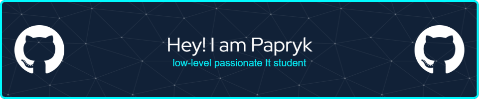

# 💫 About Me:
🌱 I’m currently learning C#, Pytohn, JavaScript, CSS  📫 How to reach me p.tarka33@gmail.com

## 🌐 Socials:
  

# 💻 Tech Stack:
      
# 📊 GitHub Stats:

 
 

<!-- Proudly created with GPRM ( https://gprm.itsvg.in ) -->
